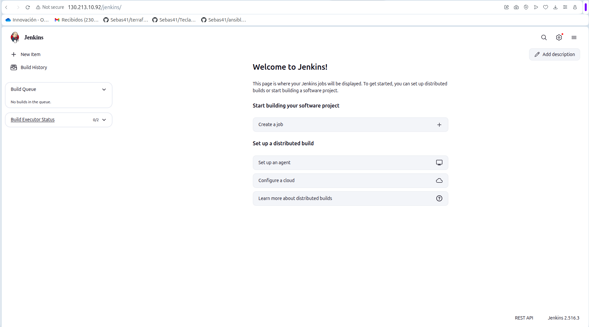
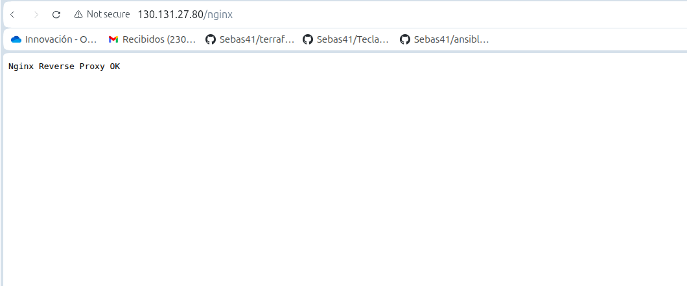
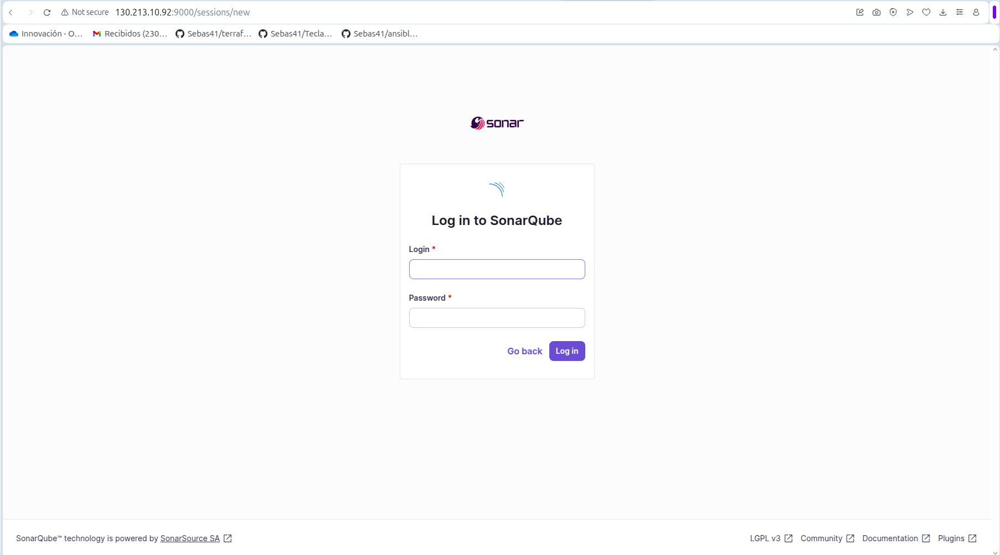

# Proyecto: ansible-pipeline (Teclado)


---

## Descripción general

Este proyecto contiene la infraestructura y automatización necesarias para **desplegar y probar el sitio web “Teclado”** utilizando **Ansible**, **Docker Compose**, **Jenkins** y **SonarQube**.

El entorno implementa un flujo completo de **CI/CD**, donde Jenkins analiza el código con SonarQube y despliega automáticamente la aplicación estática en un servidor **Nginx remoto**.

---

## Arquitectura general

| Servicio | Máquina | Descripción |
|-----------|----------|-------------|
| **Jenkins + SonarQube + PostgreSQL** | `130.213.10.92` | CI server + análisis de código. |
| **Nginx (Reverse Proxy + Static Site)** | `130.131.27.80` | Proxy reverso + despliegue de app estática. |

---

## Estructura del repositorio

```
ansible-pipeline-server/
│
├── imagenes/
│   ├── jenkins-vm.png
│   ├── nginx-vm.png
│   └── sonar-puerto.png
│
├── inventories/
│   └── prod/
│       └── hosts.ini
│
├── templates/
│   ├── nginx.conf.j2
│   ├── docker-compose-jenkins.yml
│   ├── docker-compose-nginx.yml
│   └── nginx.conf
│
├── playbook.yml
├── plugins.txt
├── requirements.txt
├── update-keyword-app.yml
└── README.md
```

---

La VM Jenkins (130.213.10.92) tiene como propósito principal funcionar como servidor de aplicaciones y servicios. En ella se alojan Jenkins, SonarQube y PostgreSQL, que son los componentes más pesados del sistema. Entre sus ventajas, destaca su alta capacidad de procesamiento, ideal para ejecutar builds y análisis de código de forma eficiente. Además, su mantenimiento es más flexible, ya que se puede reiniciar o actualizar sin interrumpir el funcionamiento del proxy o afectar a los usuarios externos.

Por otro lado, la VM Nginx (130.131.27.80) actúa como reverse proxy y punto de entrada único a toda la infraestructura. Esta máquina solo contiene Nginx, lo que la hace liviana y eficiente. Protege y canaliza el tráfico hacia los servicios internos. Entre sus principales ventajas se encuentran el hecho de ofrecer un punto de acceso centralizado y mejorar la seguridad, ya que filtra y valida las peticiones antes de que lleguen a Jenkins. Además, permite implementar balanceo de carga en caso de añadir más VMs Jenkins, administrar certificados SSL/TLS desde un solo lugar, aplicar limitación de tasa (rate limiting) para controlar el tráfico y centralizar los logs de acceso, facilitando el monitoreo y la auditoría del sistema.

## Archivos clave

### `hosts.ini`
Define los hosts gestionados por Ansible:
```ini
[jenkins]
jenkins-machine ansible_host=130.213.10.92 ansible_user=adminuser ansible_python_interpreter=/usr/bin/python3

[nginx]
nginx-machine ansible_host=130.131.27.80 ansible_user=adminuser ansible_python_interpreter=/usr/bin/python3

[all:vars]
ansible_become=true
ansible_become_method=sudo
ansible_ssh_common_args='-o StrictHostKeyChecking=no'
```

### `nginx.conf.j2`
Template que configura el proxy reverso para Jenkins y SonarQube, además de servir la app estática `Teclado` desde `/var/www/keyboard-app/`.

### `docker-compose-jenkins.yml`
Despliega **Jenkins**, **SonarQube** y **PostgreSQL** en una sola VM.  
Configura Jenkins con `--prefix=/jenkins` y SonarQube con `sonar.web.context=/sonar`.

### `docker-compose-nginx.yml`
Despliega **Nginx** como proxy reverso y servidor web para la app.

### `playbook.yml`
Playbook maestro con dos roles:
1. **Provisionar Jenkins VM** → instala Docker y levanta Jenkins/SonarQube.
2. **Provisionar Nginx VM** → instala Docker, clona el repo y despliega la app.

### `plugins.txt`
Lista de plugins que Jenkins instala automáticamente:
```
git:latest
workflow-aggregator:latest
blueocean:latest
sonar:latest
configuration-as-code:latest
```

---

## Despliegue

### Editar inventario
Actualiza `inventories/prod/hosts.ini` con tus IPs y usuarios.

### Ejecutar playbook
```bash
ansible-playbook -i inventories/prod/hosts.ini playbook.yml --ask-pass
```

### Acceder a los servicios
| Servicio | URL |
|-----------|------|
| Jenkins | http://130.213.10.92/jenkins/ |
| SonarQube | http://130.213.10.92/sonar/ |
| Sitio Teclado | http://130.131.27.80/keyboard/ |

---

## 🔁 Flujo CI/CD

1. Jenkins detecta cambios en el repo **Teclado**.  
2. Ejecuta el **Jenkinsfile** del proyecto que:
   - Lanza análisis SonarQube.
   - Empaqueta el sitio.
   - Despliega el contenido a Nginx remoto.  
3. Nginx se recarga automáticamente mostrando la nueva versión.

---

## Buenas prácticas

- **Seguridad:** Usa Ansible Vault o Jenkins Credentials para proteger tokens.  
- **Persistencia:** Monta volúmenes externos para `/var/jenkins_home` y `/opt/sonarqube/data`.  
- **Automatización:** Jenkins para builds automáticas.  

---

## Resumen de cambios

| Tipo | Archivo | Descripción |
|------|----------|-------------|
| Añadido | `inventories/prod/hosts.ini` | Inventario con IPs reales de Jenkins y Nginx. |
| Modificado | `playbook.yml` | Instalación de Docker + despliegue de servicios. |
| Añadido | `templates/nginx.conf.j2` | Proxy reverso entre Jenkins, SonarQube y app. |
| Añadido | `docker-compose-jenkins.yml` | Stack Jenkins + SonarQube + PostgreSQL. |
| Añadido | `docker-compose-nginx.yml` | Stack Nginx y docroot de app Teclado. |
| Añadido | `plugins.txt` | Lista de plugins esenciales para Jenkins. |

---

## Evidencia visual

### Jenkins VM


### Nginx VM


### SonarQube


---